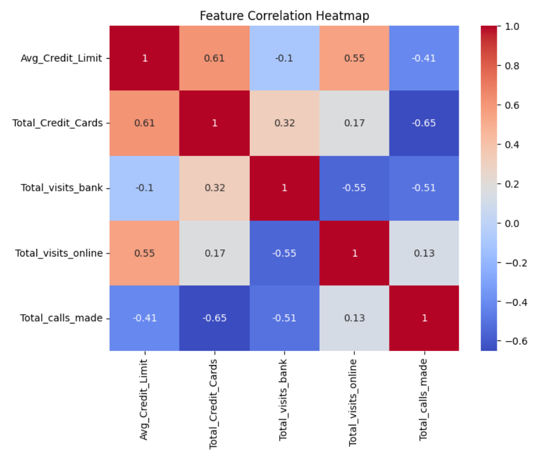
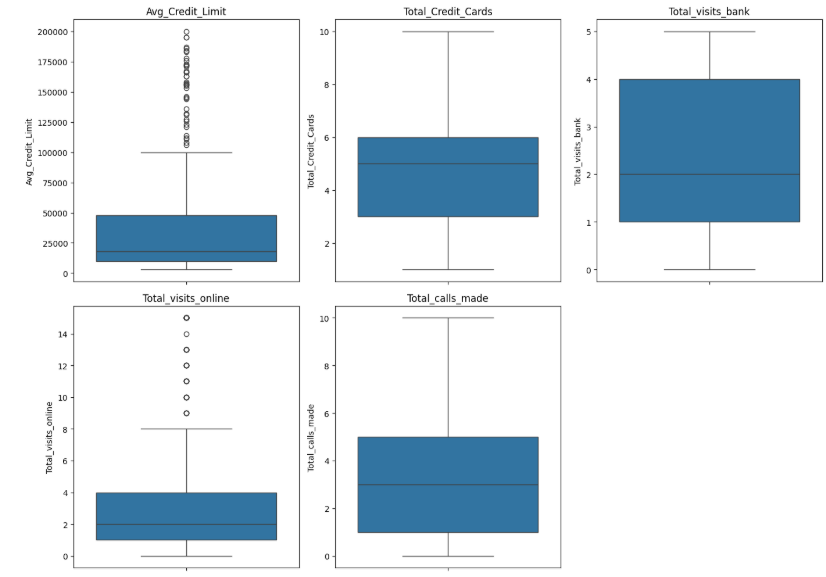
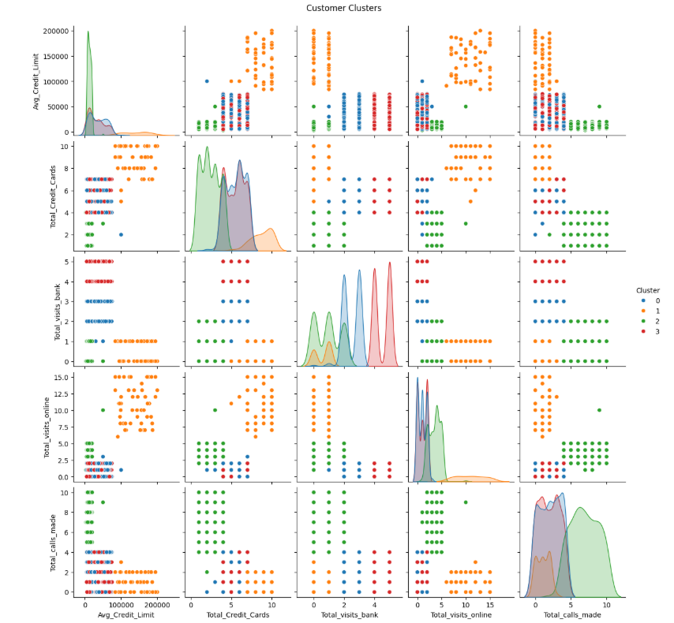
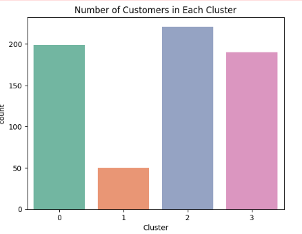

Customer Segmentation using K-Means Clustering
📌 Overview

This project applies K-Means Clustering, an unsupervised machine learning algorithm, to segment credit card customers based on their behavioral patterns. It helps businesses identify different customer groups for targeted marketing and improved customer experience.

🚀 Objective

To cluster customers into distinct groups based on their credit card usage and spending habits, enabling data-driven business strategies and personalized services.

🧰 Technologies Used

Python 3

Jupyter Notebook

NumPy, Pandas – Data Manipulation

Matplotlib, Seaborn – Data Visualization

Scikit-learn – Machine Learning (K-Means Clustering)

StandardScaler – Data Normalization

📂 Dataset

The dataset contains information about credit card holders, including:

Balance

Purchases

Credit Limit

Payments

Tenure, etc.

📥 Downloaded from: [Kaggle or UCI Machine Learning Repository]

📊 Exploratory Data Analysis (EDA)

Key steps in data understanding:

Descriptive statistics

Null value analysis

Correlation heatmap

Distribution plots

🔧 Data Preprocessing

Removed irrelevant columns (e.g., CUST_ID)

Handled missing values

Normalized the data using StandardScaler

from sklearn.preprocessing import StandardScaler
scaler = StandardScaler()
scaled_data = scaler.fit_transform(data)

🤖 Clustering with K-Means

Used Elbow Method to find the optimal number of clusters.

Plotted WCSS (Within-Cluster Sum of Squares) vs number of clusters.

from sklearn.cluster import KMeans

wcss = []
for i in range(1, 11):
    kmeans = KMeans(n_clusters=i, init='k-means++', random_state=42)
    kmeans.fit(scaled_data)
    wcss.append(kmeans.inertia_)

Applied KMeans with optimal k and labeled clusters.

📈 Cluster Analysis

Visualized clusters using PCA (Principal Component Analysis)

Analyzed customer segments and extracted business insights.

preview:

💡 Key Insights

Identified high-spending and low-spending customers.

Found patterns like high usage but low payments or credit limit.

Enables marketing to focus on high-value customer clusters.

📌 Folder Structure
Credit-Card-Customer-Segmentation/
│
├── dataset/
│   └── credit_card.csv
├── notebook/
│   └── Credit_Card_Clustering.ipynb
├── images/
│   └── elbow_method.png
│   └── cluster_visualization.png
├── README.md
└── requirements.txt

✅ How to Run

Clone the repo:

git clone https://github.com/yourusername/credit-card-segmentation.git

Install dependencies:

pip install -r requirements.txt

Launch Jupyter Notebook:

jupyter notebook
